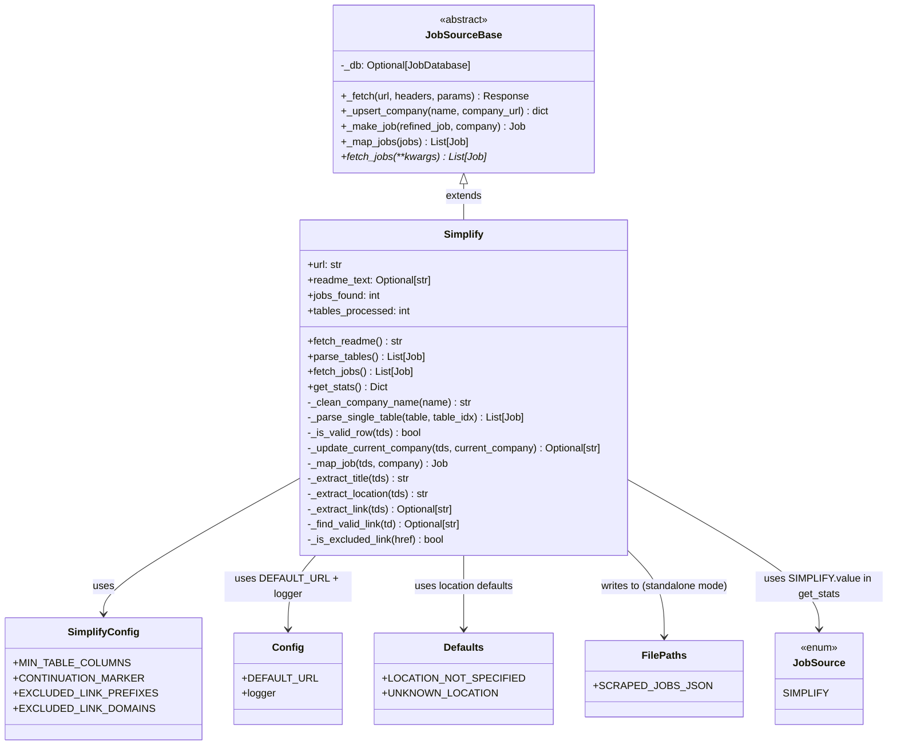

```mermaid
%% classDiagram — Simplify structure and relationships
classDiagram
    class Simplify {
        +url: str
        +readme_text: Optional[str]
        +jobs_found: int
        +tables_processed: int
        +fetch_readme() str
        +parse_tables() List[Job]
        +fetch_jobs() List[Job]
        +get_stats() Dict
        -_clean_company_name(name) str
        -_parse_single_table(table, table_idx) List[Job]
        -_is_valid_row(tds) bool
        -_update_current_company(tds, current_company) Optional[str]
        -_map_job(tds, company) Job
        -_extract_title(tds) str
        -_extract_location(tds) str
        -_extract_link(tds) Optional[str]
        -_find_valid_link(td) Optional[str]
        -_is_excluded_link(href) bool
    }

    class JobSourceBase {
        <<abstract>>
        -_db: Optional[JobDatabase]
        +_fetch(url, headers, params) Response
        +_upsert_company(name, company_url) dict
        +_make_job(refined_job, company) Job
        +_map_jobs(jobs) List[Job]
        +fetch_jobs(**kwargs) List[Job]*
    }

    class SimplifyConfig {
        +MIN_TABLE_COLUMNS
        +CONTINUATION_MARKER
        +EXCLUDED_LINK_PREFIXES
        +EXCLUDED_LINK_DOMAINS
    }

    class Config {
        +DEFAULT_URL
        +logger
    }

    class Defaults {
        +LOCATION_NOT_SPECIFIED
        +UNKNOWN_LOCATION
    }

    class FilePaths {
        +SCRAPED_JOBS_JSON
    }

    class JobSource {
        <<enum>>
        SIMPLIFY
    }

    JobSourceBase <|-- Simplify : extends
    Simplify --> SimplifyConfig : uses
    Simplify --> Config : uses DEFAULT_URL + logger
    Simplify --> Defaults : uses location defaults
    Simplify --> FilePaths : writes to (standalone mode)
    Simplify --> JobSource : uses SIMPLIFY.value in get_stats


```