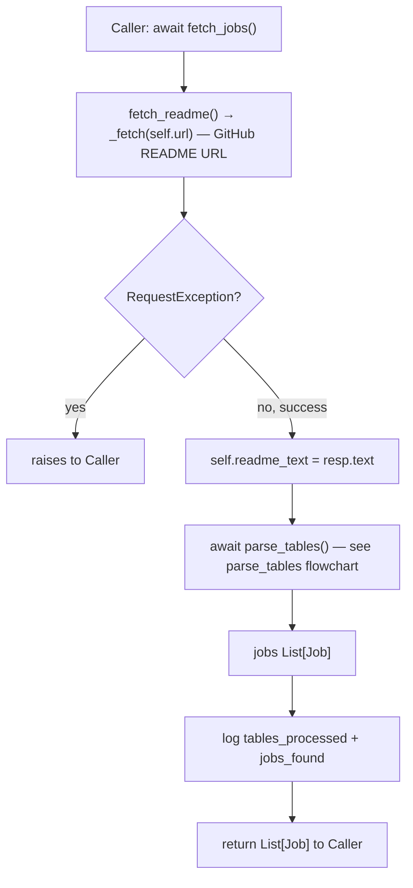
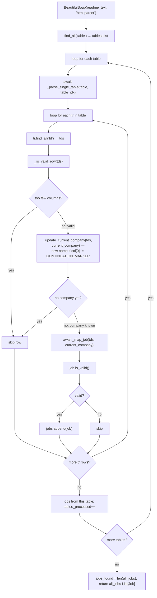
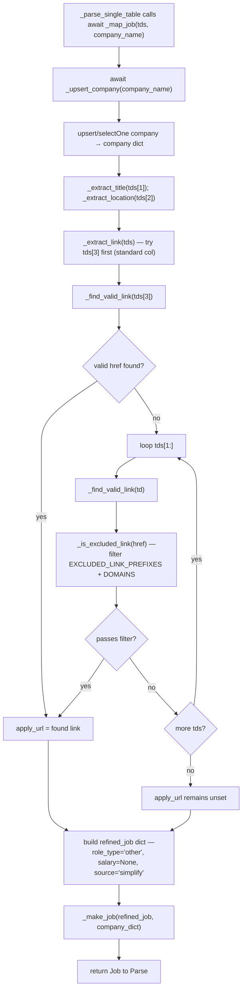

```mermaid
%% flowchart — fetch_jobs (top-level orchestration)
flowchart TD
    A["Caller: await fetch_jobs()"] --> B["fetch_readme() → _fetch(self.url) — GitHub README URL"]
    B --> C{RequestException?}
    C -->|yes| D[raises to Caller]
    C -->|no, success| E["self.readme_text = resp.text"]
    E --> F["await parse_tables() — see parse_tables flowchart"]
    F --> G["jobs List[Job]"]
    G --> H["log tables_processed + jobs_found"]
    H --> I["return List[Job] to Caller"]
```

```mermaid
%% flowchart — parse_tables → _parse_single_table (HTML traversal)
flowchart TD
    A["BeautifulSoup(readme_text, 'html.parser')"] --> B["find_all('table') → tables List"]
    B --> C[loop for each table]
    C --> D["await _parse_single_table(table, table_idx)"]
    D --> E[loop for each tr in table]
    E --> F["tr.find_all('td') → tds"]
    F --> G["_is_valid_row(tds)"]
    G --> H{too few columns?}
    H -->|yes| I[skip row]
    H -->|no, valid| J["_update_current_company(tds, current_company) —<br/>new name if col[0] != CONTINUATION_MARKER"]
    J --> K{no company yet?}
    K -->|yes| I
    K -->|no, company known| L["await _map_job(tds, current_company)"]
    L --> M["job.is_valid()"]
    M --> N{valid?}
    N -->|yes| O["jobs.append(job)"]
    N -->|no| P[skip]
    I --> Q{more tr rows?}
    O --> Q
    P --> Q
    Q -->|yes| E
    Q -->|no| R["jobs from this table; tables_processed++"]
    R --> S{more tables?}
    S -->|yes| C
    S -->|no| T["jobs_found = len(all_jobs); return all_jobs List[Job]"]
```

```mermaid
%% flowchart — _map_job (row → Job) and _extract_link
flowchart TD
    A["_parse_single_table calls await _map_job(tds, company_name)"] --> B["await _upsert_company(company_name)"]
    B --> C["upsert/selectOne company → company dict"]
    C --> D["_extract_title(tds[1]); _extract_location(tds[2])"]
    D --> E["_extract_link(tds) — try tds[3] first (standard col)"]
    E --> F["_find_valid_link(tds[3])"]
    F --> G{valid href found?}
    G -->|yes| H[apply_url = found link]
    G -->|no| I["loop tds[1:]"]
    I --> J["_find_valid_link(td)"]
    J --> K["_is_excluded_link(href) —<br/>filter EXCLUDED_LINK_PREFIXES + DOMAINS"]
    K --> L{passes filter?}
    L -->|yes| H
    L -->|no| M{more tds?}
    M -->|yes| I
    M -->|no| N[apply_url remains unset]
    H --> O["build refined_job dict —<br/>role_type='other', salary=None, source='simplify'"]
    N --> O
    O --> P["_make_job(refined_job, company_dict)"]
    P --> Q["return Job to Parse"]
```
