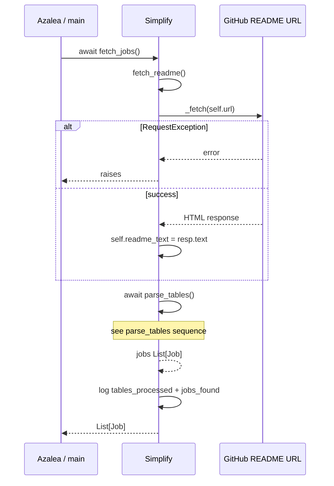
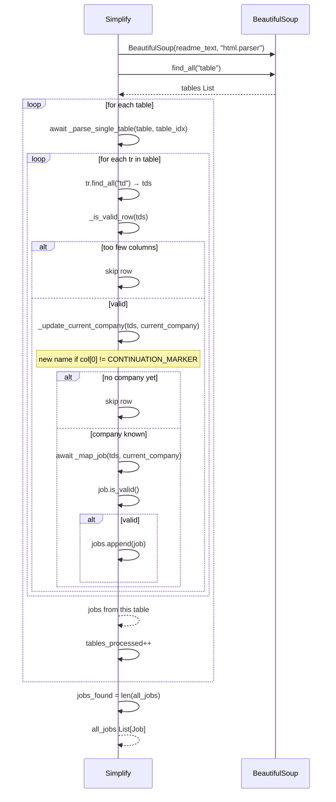
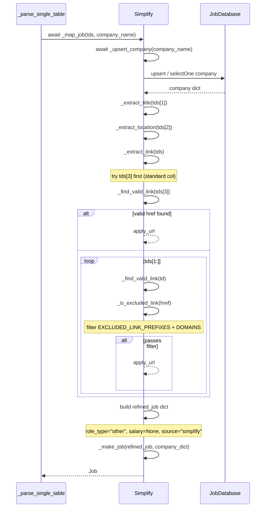

```mermaid
%% sequenceDiagram — fetch_jobs (top-level orchestration)
sequenceDiagram
    participant Caller as Azalea / main
    participant S as Simplify
    participant GH as GitHub README URL

    Caller->>S: await fetch_jobs()
    S->>S: fetch_readme()
    S->>GH: _fetch(self.url)
    alt RequestException
        GH-->>S: error
        S-->>Caller: raises
    else success
        GH-->>S: HTML response
        S->>S: self.readme_text = resp.text
    end

    S->>S: await parse_tables()
    Note over S: see parse_tables sequence
    S-->>S: jobs List[Job]

    S->>S: log tables_processed + jobs_found
    S-->>Caller: List[Job]
```

```mermaid
%% sequenceDiagram — parse_tables → _parse_single_table (HTML traversal)
sequenceDiagram
    participant S as Simplify
    participant BS as BeautifulSoup

    S->>BS: BeautifulSoup(readme_text, "html.parser")
    S->>BS: find_all("table")
    BS-->>S: tables List

    loop for each table
        S->>S: await _parse_single_table(table, table_idx)

        loop for each tr in table
            S->>S: tr.find_all("td") → tds
            S->>S: _is_valid_row(tds)
            alt too few columns
                S->>S: skip row
            else valid
                S->>S: _update_current_company(tds, current_company)
                Note over S: new name if col[0] != CONTINUATION_MARKER
                alt no company yet
                    S->>S: skip row
                else company known
                    S->>S: await _map_job(tds, current_company)
                    S->>S: job.is_valid()
                    alt valid
                        S->>S: jobs.append(job)
                    end
                end
            end
        end

        S-->>S: jobs from this table
        S->>S: tables_processed++
    end

    S->>S: jobs_found = len(all_jobs)
    S-->>S: all_jobs List[Job]


```

```mermaid
%% sequenceDiagram — _map_job (row → Job) and _extract_link
sequenceDiagram
    participant Parse as _parse_single_table
    participant S as Simplify
    participant DB as JobDatabase

    Parse->>S: await _map_job(tds, company_name)
    S->>S: await _upsert_company(company_name)
    S->>DB: upsert / selectOne company
    DB-->>S: company dict

    S->>S: _extract_title(tds[1])
    S->>S: _extract_location(tds[2])

    S->>S: _extract_link(tds)
    Note over S: try tds[3] first (standard col)
    S->>S: _find_valid_link(tds[3])
    alt valid href found
        S-->>S: apply_url
    else
        loop tds[1:]
            S->>S: _find_valid_link(td)
            S->>S: _is_excluded_link(href)
            Note over S: filter EXCLUDED_LINK_PREFIXES + DOMAINS
            alt passes filter
                S-->>S: apply_url
            end
        end
    end

    S->>S: build refined_job dict
    Note over S: role_type="other", salary=None, source="simplify"
    S->>S: _make_job(refined_job, company_dict)
    S-->>Parse: Job

```