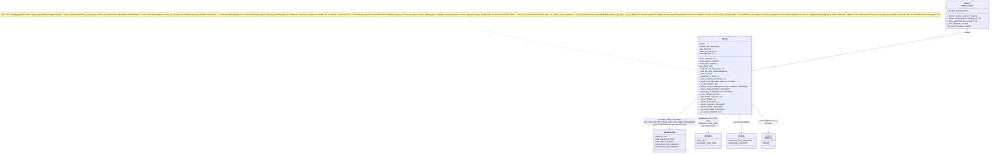

```mermaid
%% classDiagram — Speedy structure and relationships
classDiagram
    class Speedy {
        +url: str
        +readme_text: Optional[str]
        +jobs_found: int
        +tables_processed: int
        +max_age_days: int
        +fetch_readme() str
        +parse_tables() List[Job]
        +fetch_jobs() List[Job]
        +get_stats() Dict
        -_compute_max_age_days() int
        -_load_last_run() Optional[datetime]
        -_save_last_run()
        -_markdown_to_html() str
        -_clean_company_name(name) str
        -_parse_single_table(table, table_idx) List[Job]
        -_is_valid_row(tds) bool
        -_update_current_company(tds, current_company) Optional[str]
        -_extract_date_posted(tds) Optional[str]
        -_parse_age_to_days(age_str) Optional[int]
        -_is_too_old(age_str) bool
        -_map_job(tds, company) Job
        -_extract_title(tds) str
        -_extract_location(tds) str
        -_extract_salary(tds) Optional[str]
        -_extract_link(tds) Optional[str]
        -_find_valid_link(td) Optional[str]
        -_is_excluded_link(href) bool
    }

    class JobSourceBase {
        <<abstract>>
        -_db: Optional[JobDatabase]
        +_fetch(url, headers, params) Response
        +_upsert_company(name, company_url) dict
        +_make_job(refined_job, company) Job
        +_map_jobs(jobs) List[Job]
        +fetch_jobs(**kwargs) List[Job]*
    }

    class SpeedyConfig {
        +DEFAULT_URL
        +MIN_TABLE_COLUMNS
        +MAX_JOB_AGE_DAYS
        +EXCLUDED_LINK_PREFIXES
        +EXCLUDED_LINK_DOMAINS
    }

    class FilePaths {
        +LAST_RUN
        +SCRAPED_JOBS_JSON
    }

    class Defaults {
        +LOCATION_NOT_SPECIFIED
        +UNKNOWN_LOCATION
    }

    class JobSource {
        <<enum>>
        SPEEDY
    }

    JobSourceBase <|-- Speedy : extends
    Speedy --> SpeedyConfig : uses (MIN_TABLE_COLUMNS, MAX_JOB_AGE_DAYS,\nEXCLUDED_LINK_PREFIXES/DOMAINS, which reuse\nSimplifyConfig's link-filter lists)
    Speedy --> FilePaths : reads/writes LAST_RUN, writes SCRAPED_JOBS_JSON (standalone mode)
    Speedy --> Defaults : uses location defaults
    Speedy --> JobSource : uses SPEEDY.value in get_stats

    note for Speedy "New source (speedyapply/2027-SWE-College-Jobs),\nadded alongside Simplify — always registered in\nAzalea._init_helpers(), no API key needed.\n\nThe README is GFM Markdown, not raw HTML like\nSimplify's, so fetch goes through the `markdown`\npackage (markdown.markdown(..., extensions=['tables']))\nbefore the same BeautifulSoup table-parsing approach\nSimplify uses. NOTE: the `markdown` package is used\nhere but is not listed in requirements.txt — see Roadmap.\n\nColumn layout differs from Simplify (Company | Position |\nLocation | Salary | Posting | Age vs Simplify's Company |\nRole | Location | Application | Age), and Speedy has no\ncontinuation-row marker — every row repeats the full\ncompany name, so _update_current_company is a no-op\nkept for structural parity with Simplify.\n\nmax_age_days / _is_too_old() is new, shared in spirit\nwith Simplify's identical age-filtering addition: each\nsource stamps its own key in resources/last_run.json\nafter a successful fetch, and computes how many days\nback to look next time (elapsed since last run, capped\nat MAX_JOB_AGE_DAYS, minimum 1). Tables are assumed\nsorted newest-first, so parsing stops at the first row\nolder than the cutoff rather than scanning the rest."
```
