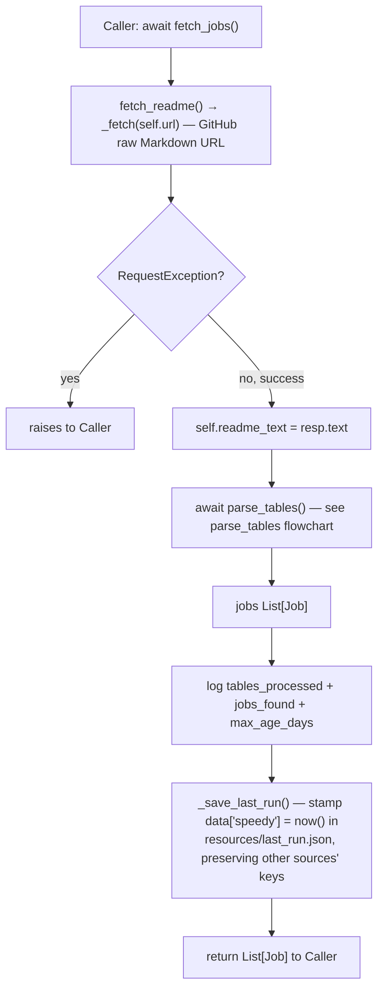
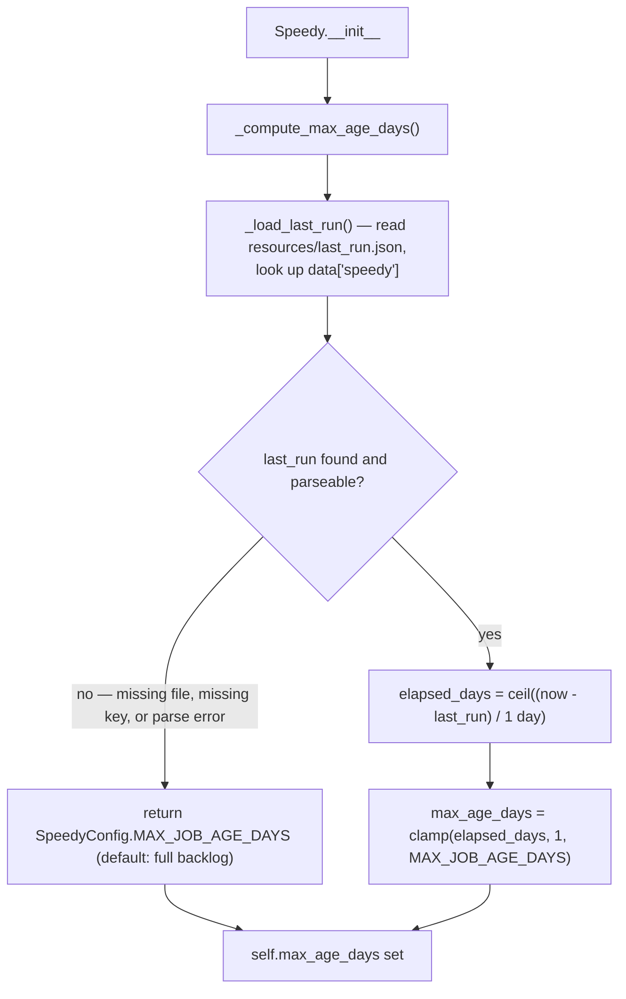
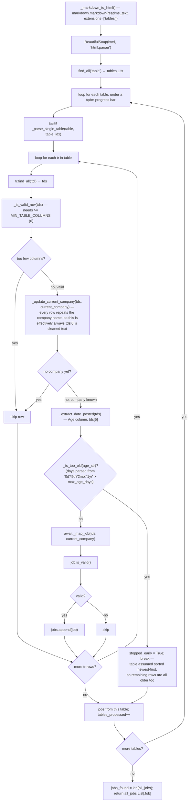
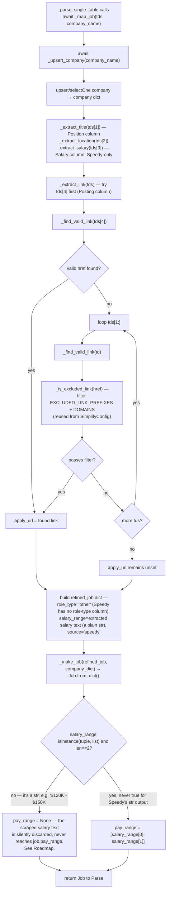

```mermaid
%% flowchart — fetch_jobs (top-level orchestration)
flowchart TD
    A["Caller: await fetch_jobs()"] --> B["fetch_readme() → _fetch(self.url) — GitHub raw Markdown URL"]
    B --> C{RequestException?}
    C -->|yes| D[raises to Caller]
    C -->|no, success| E["self.readme_text = resp.text"]
    E --> F["await parse_tables() — see parse_tables flowchart"]
    F --> G["jobs List[Job]"]
    G --> H["log tables_processed + jobs_found + max_age_days"]
    H --> I["_save_last_run() — stamp data['speedy'] = now() in\nresources/last_run.json, preserving other sources' keys"]
    I --> J["return List[Job] to Caller"]
```

```mermaid
%% flowchart — __init__ (max_age_days computation, before any fetch happens)
flowchart TD
    A["Speedy.__init__"] --> B["_compute_max_age_days()"]
    B --> C["_load_last_run() — read resources/last_run.json,\nlook up data['speedy']"]
    C --> D{last_run found and parseable?}
    D -->|no — missing file, missing key, or parse error| E["return SpeedyConfig.MAX_JOB_AGE_DAYS (default: full backlog)"]
    D -->|yes| F["elapsed_days = ceil((now - last_run) / 1 day)"]
    F --> G["max_age_days = clamp(elapsed_days, 1, MAX_JOB_AGE_DAYS)"]
    E --> H["self.max_age_days set"]
    G --> H
```

```mermaid
%% flowchart — parse_tables → _parse_single_table (Markdown→HTML, then table traversal)
flowchart TD
    A["_markdown_to_html() — markdown.markdown(readme_text, extensions=['tables'])"] --> B["BeautifulSoup(html, 'html.parser')"]
    B --> C["find_all('table') → tables List"]
    C --> D[loop for each table, under a tqdm progress bar]
    D --> E["await _parse_single_table(table, table_idx)"]
    E --> F[loop for each tr in table]
    F --> G["tr.find_all('td') → tds"]
    G --> H["_is_valid_row(tds) — needs >= MIN_TABLE_COLUMNS (6)"]
    H --> I{too few columns?}
    I -->|yes| J[skip row]
    I -->|no, valid| K["_update_current_company(tds, current_company) —<br/>every row repeats the company name, so this is\neffectively always tds[0]'s cleaned text"]
    K --> L{no company yet?}
    L -->|yes| J
    L -->|no, company known| M["_extract_date_posted(tds) — Age column, tds[5]"]
    M --> N{"_is_too_old(age_str)?<br/>(days parsed from '0d'/'5d'/'2mo'/'1yr' > max_age_days)"}
    N -->|yes| O["stopped_early = True; break —<br/>table assumed sorted newest-first,\nso remaining rows are all older too"]
    N -->|no| P["await _map_job(tds, current_company)"]
    P --> Q["job.is_valid()"]
    Q --> R{valid?}
    R -->|yes| S["jobs.append(job)"]
    R -->|no| T[skip]
    J --> U{more tr rows?}
    S --> U
    T --> U
    U -->|yes| F
    U -->|no| V["jobs from this table; tables_processed++"]
    O --> V
    V --> W{more tables?}
    W -->|yes| D
    W -->|no| X["jobs_found = len(all_jobs); return all_jobs List[Job]"]
```

```mermaid
%% flowchart — _map_job (row → Job) and _extract_link
flowchart TD
    A["_parse_single_table calls await _map_job(tds, company_name)"] --> B["await _upsert_company(company_name)"]
    B --> C["upsert/selectOne company → company dict"]
    C --> D["_extract_title(tds[1]) — Position column<br/>_extract_location(tds[2])<br/>_extract_salary(tds[3]) — Salary column, Speedy-only"]
    D --> E["_extract_link(tds) — try tds[4] first (Posting column)"]
    E --> F["_find_valid_link(tds[4])"]
    F --> G{valid href found?}
    G -->|yes| H[apply_url = found link]
    G -->|no| I["loop tds[1:]"]
    I --> J["_find_valid_link(td)"]
    J --> K["_is_excluded_link(href) —<br/>filter EXCLUDED_LINK_PREFIXES + DOMAINS<br/>(reused from SimplifyConfig)"]
    K --> L{passes filter?}
    L -->|yes| H
    L -->|no| M{more tds?}
    M -->|yes| I
    M -->|no| N[apply_url remains unset]
    H --> O["build refined_job dict —<br/>role_type='other' (Speedy has no role-type column),<br/>salary_range=extracted salary text (a plain str), source='speedy'"]
    N --> O
    O --> P["_make_job(refined_job, company_dict) → Job.from_dict()"]
    P --> Q{"salary_range isinstance(tuple, list) and len==2?"}
    Q -->|no — it's a str, e.g. '$120K - $150K'| R["pay_range = None — the scraped salary text\nis silently discarded, never reaches job.pay_range.\nSee Roadmap."]
    Q -->|yes, never true for Speedy's str output| S["pay_range = [salary_range[0], salary_range[1]]"]
    R --> T["return Job to Parse"]
    S --> T
```
