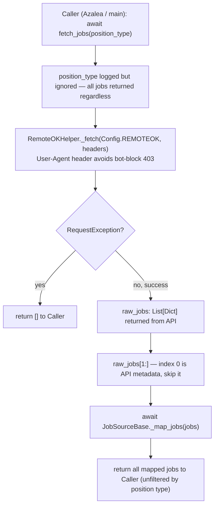
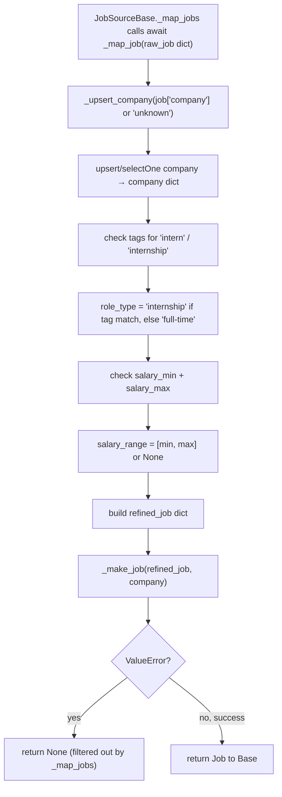

```mermaid
%% flowchart — fetch_jobs (fetch, strip metadata, map)
%% BUG: position_type parameter is accepted but never used for filtering.
%% RemoteOK API has no type filter; _map_job infers role_type from tags only.
%% fetch_from_source also calls helper.fetch_jobs() with no args (case _),
%% so position_type is dropped before it even reaches this method.
flowchart TD
    A["Caller (Azalea / main): await fetch_jobs(position_type)"] --> B["position_type logged but ignored — all jobs returned regardless"]
    B --> C["RemoteOKHelper._fetch(Config.REMOTEOK, headers)<br/>User-Agent header avoids bot-block 403"]
    C --> D{RequestException?}
    D -->|yes| E["return [] to Caller"]
    D -->|no, success| F["raw_jobs: List[Dict] returned from API"]
    F --> G["raw_jobs[1:] — index 0 is API metadata, skip it"]
    G --> H["await JobSourceBase._map_jobs(jobs)"]
    H --> I["return all mapped jobs to Caller (unfiltered by position type)"]
```

```mermaid
%% flowchart — _map_job (single raw dict → Job)
flowchart TD
    A["JobSourceBase._map_jobs calls await _map_job(raw_job dict)"] --> B["_upsert_company(job['company'] or 'unknown')"]
    B --> C["upsert/selectOne company → company dict"]
    C --> D["check tags for 'intern' / 'internship'"]
    D --> E["role_type = 'internship' if tag match, else 'full-time'"]
    E --> F["check salary_min + salary_max"]
    F --> G["salary_range = [min, max] or None"]
    G --> H[build refined_job dict]
    H --> I["_make_job(refined_job, company)"]
    I --> J{ValueError?}
    J -->|yes| K["return None (filtered out by _map_jobs)"]
    J -->|no, success| L["return Job to Base"]
```
