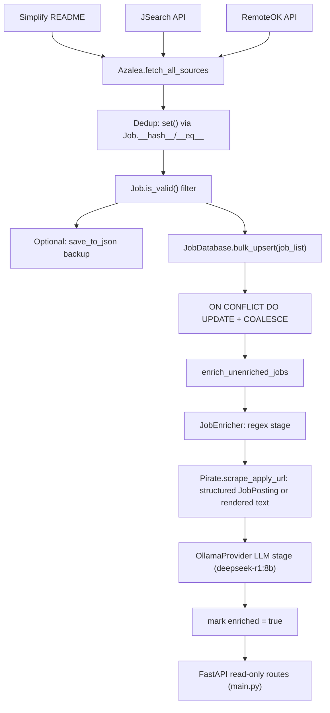

# Architecture

## End-to-end flow



## Orchestrator: `Service/azalea.py`

`Azalea` is the controller. `_init_helpers()` builds a `helpers` dict keyed by `JobSource` enum — Simplify is always on, JSearch only if its API key is configured, RemoteOK via a `Config.REMOTEOK` check that's actually a hardcoded URL string (always truthy, so RemoteOK always registers regardless of any intended toggle). `run()` has two modes, both converging on the same DB-insert step:

**Production mode (`test=False`, the normal path via `Tasks/scrape.py`):**

1. `fetch_all_sources()` — concurrently pulls from every configured source, tags per-source counts on `self.stats` (`JobStats`)
2. Dedup via Python `set()` — relies on `Job.__hash__`/`__eq__` keyed on `(title, company, location, apply_url)` — then filters through `Job.is_valid()`
3. `self.jobs = unique_jobs` — this is the key line: `self.jobs` becomes the single source of truth for the rest of `run()`, shared by both modes
4. Optional JSON backup via `Config.save_to_json([Job.to_dict(job) for job in unique_jobs])` — note this uses `to_dict()`, not `to_dict_for_db()` (see below)
5. `fin_jobs = [Job.to_dict_for_db(job) for job in self.jobs if job.title != "unknown"]`, then `bulk_upsert` into `job_list` with `ON CONFLICT (title, company, apply_url) DO UPDATE` — see [[Database-Layer]] for the COALESCE trick

**Test mode (`test=True`, used for iterating on enrichment logic without re-scraping):**

1. Skips fetch/dedup entirely, loads from the local `resources/scraped_jobs.json` backup instead (max 20 jobs)
2. Reconstructs each raw JSON dict back into a proper `Job` object via `Job.from_dict(job_dict, company=UUID(...))`, appending to `self.jobs`
3. From here it converges with production mode: same `fin_jobs = [Job.to_dict_for_db(job) for job in self.jobs ...]` conversion, same `bulk_upsert` call
4. Additionally runs `enrich_unenriched_jobs(batch_size=20)` right after inserting — production mode skips this

> ⚠️ **Bug found and fixed:** test mode used to build the DB-bound list directly from the raw JSON file, skipping the `to_dict_for_db()` conversion that normalizes `company` into a real UUID object and coerces `tags` into a proper dict. The reconstructed `Job` objects were built correctly in a loop but never actually used for the DB insert — the raw, unconverted JSON went in instead. Fixed by making `self.jobs` the shared source of truth for both modes, with the `to_dict_for_db()` conversion happening once, right before the DB call, regardless of which mode populated `self.jobs`.

## Why enrichment is decoupled from scraping

Scraping runs 5x/day (cron in `scrape.yaml`); enrichment only runs on the `0 5 * * *` slot (or manual dispatch). This keeps local Ollama enrichment time bounded and means a scrape failure doesn't block enrichment of already-inserted rows, and vice versa.

## The enrichment stack, at a glance

```
Refine/refine.py       — enrich_unenriched_jobs(): DB-driven batch loop, retry-cap logic
    └─ Refine/extractor.py  — JobEnricher: orchestrates regex → scrape → LLM stages per job
         ├─ RegexConstants       — pay/remote/role/experience regex, anchor-keyword filtering
         ├─ Service/Scrapper.py::Pirate  — Playwright/requests scraping, JobPosting JSON-LD, expired detection
         └─ Refine/llm.py::OllamaProvider — local LLM extraction, JSON repair, LLMParseError
              └─ Utils/sanitate.py::JobDataSanitizer — coerces/cleans raw LLM JSON before it touches the DB
```

See [[Enrichment-Pipeline]] for the full per-stage breakdown and [[Deployment-CI-CD]] for the actual schedule/workflow wiring.
