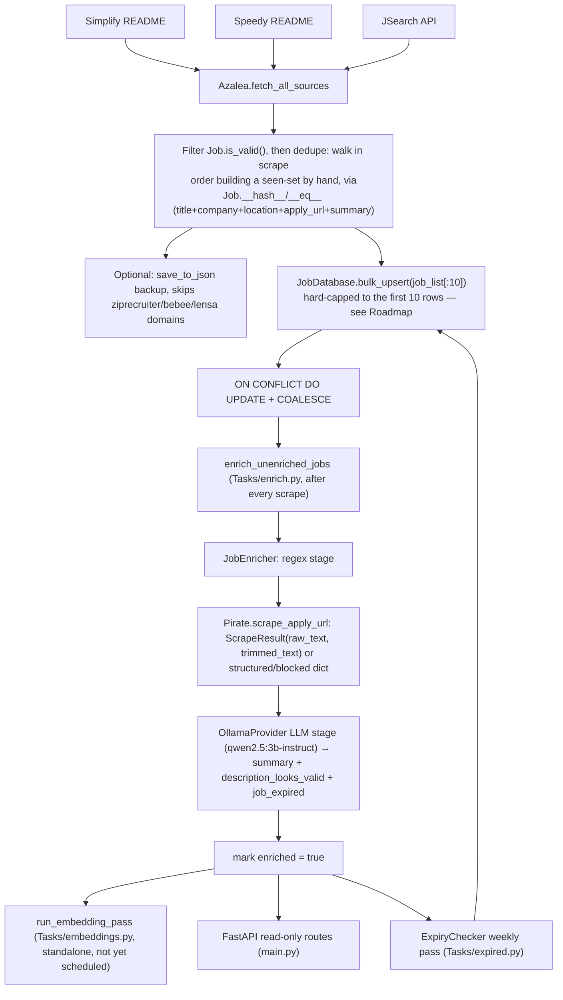

# Architecture

## End-to-end flow



Note: `Speedy` is a new source, always-registered in `_init_helpers()` same as `Simplify`. `JSearch` registers the same way it always has — conditionally, based on whether `J_SEARCH_API_KEY` is set.

## Orchestrator: `Service/azalea.py`

`Azalea` is the controller. `_init_helpers()` builds a `helpers` dict keyed by `JobSource` enum — Simplify and Speedy are both always on, JSearch only if its API key is configured. `run()` has two modes, both converging on the same DB-insert step:

**Production mode (`test=False`, the normal path via `Tasks/scrape.py`):**

1. `fetch_all_sources()` — builds an ordered `sources_to_run` list (Simplify if `position_type` is INTERN/HYBRID, JSearch if registered, then every other registered helper, i.e. Speedy), then pulls from each under a `tqdm` progress bar, tagging per-source counts on `self.stats` (`JobStats`)
2. Filter to `job.is_valid()`, then dedupe by walking the valid jobs in scrape order and building a seen-set by hand (no longer `list(set(...))`) — relies on `Job.__hash__`/`__eq__`, keyed on `(title, company, location, apply_url, summary)` (see [[Database-Layer]])
3. `self.jobs = unique_jobs` — this is the key line: `self.jobs` becomes the single source of truth for the rest of `run()`, shared by both modes
4. Optional JSON backup via `Config.save_to_json([Job.to_dict(job) for job in unique_jobs if not any(domain in job.apply_url for domain in domains_to_ignore)])` — domain skip-list is `{"ziprecruiter", "bebee", "lensa"}`
5. `fin_jobs = [Job.to_dict_for_db(job) for job in self.jobs if job.title != "unknown" and job.apply_url and not any(domain in job.apply_url for domain in domains_to_ignore)]`, then `bulk_upsert` into `job_list` with `ON CONFLICT (company, location, title, apply_url) DO UPDATE` — see [[Database-Layer]] for the COALESCE trick. **The call is currently `bulk_upsert("job_list", fin_jobs[:10], ...)`** — hard-capped to the first 10 rows of `fin_jobs`, marked `#TODO: Remove the 10 limit` in source. Everything past the first 10 valid jobs in a cycle is silently dropped, not deferred to next run — see [[Roadmap]].

**Test mode (`test=True`, used for iterating on enrichment logic without re-scraping):**

1. Skips fetch/dedup entirely, loads from the local `resources/scraped_jobs.json` backup instead — now capped at the **first 10** jobs (was previously the full file / 20 in older docs)
2. Reconstructs each raw JSON dict back into a proper `Job` object via `Job.from_dict(job_dict, company=company_id)`. If the JSON's `company` field isn't a valid UUID, it now falls back to `db.get_or_create_company(job_dict.get("company_name", "Unknown"))` instead of raising — a new `JobDatabase` method (see [[Database-Layer]])
3. From here it converges with production mode: same `fin_jobs` conversion, same `bulk_upsert` call
4. Additionally runs `enrich_unenriched_jobs(batch_size=5)` right after inserting — tightened down from `batch_size=20` — production mode skips this entirely

`JobDatabase.create()` is now called once at the very top of `run()`, before the test/production branch splits, rather than partway through Step 4 — needed so test mode's `get_or_create_company()` fallback has a `db` handle available during the JSON-load loop.

## Why enrichment is decoupled from scraping

Scraping runs 3×/week (`Automations.yaml`: Mon/Wed/Fri); enrichment runs immediately after every scrape (`needs: scrape`); the `ExpiryChecker` pass runs weekly (Sat), and the standalone embedding pass isn't scheduled yet (see [[Workflows]]). Enrichment is still a *separate job* from scraping — decoupled so a scrape failure doesn't block enrichment of already-inserted rows and vice versa, and so local Ollama enrichment time stays bounded — it's just no longer throttled to a subset of scrape runs now that scrape itself only fires 3×/week.

## The enrichment stack, at a glance

```
Refine/refine.py       — enrich_unenriched_jobs(): DB-driven batch loop, retry-cap logic, tqdm progress
    └─ Refine/extractor.py  — JobEnricher: orchestrates regex → scrape → LLM stages per job
         ├─ RegexConstants       — pay/remote/role/experience regex, anchor-keyword filtering
         ├─ Service/Scrapper.py::Pirate  — Playwright/requests scraping, ScrapeResult, JobPosting JSON-LD, blocked/expired detection
         └─ Refine/llm.py::OllamaProvider — local LLM extraction, JSON repair, LLMParseError, check_expired()
              └─ Utils/sanitate.py::JobDataSanitizer — coerces/cleans raw LLM JSON before it touches the DB

Tasks/embeddings.py    — run_embedding_pass(): standalone, decoupled from the above; embeds enriched
                          rows and promotes qualifying ones into enrichment_examples (RAG example bank)

Tasks/expired.py       — ExpiryChecker.run(): three-tier (HTTP → Playwright → LLM) weekly re-validation
                          of active jobs, reusing Pirate.scrape_apply_url() and check_expired()
```

## Logging & run tracing

`Utils/run_logging.py` gives every process its own `logs/run_<ts>_pid<pid>/`
folder: one file per module (`azalea.log`, `jsearch.log`, …), a `combined.log`,
and a `flow.log` that traces which stage ran in what order. The pipeline stages
(`azalea.run` → `fetch_all_sources` → per-source `fetch_jobs` → `dedup` →
`save_to_db` → `enrich`, plus `expired` / `embeddings` / the API's `serve`) are
each wrapped in a `section()` that writes `ENTER`/`EXIT` markers with a
`(from: …)` back-pointer, so `flow.log` alone shows the full run shape. Terminal
output is trimmed to warnings/errors + section banners; full detail is in the
files. See [[Logging]].

---

See [[Enrichment-Pipeline]] for the full per-stage breakdown, [[Database-Layer]] for schema/`JobDatabase` details, and [[Workflows]] for the actual schedule/workflow wiring.