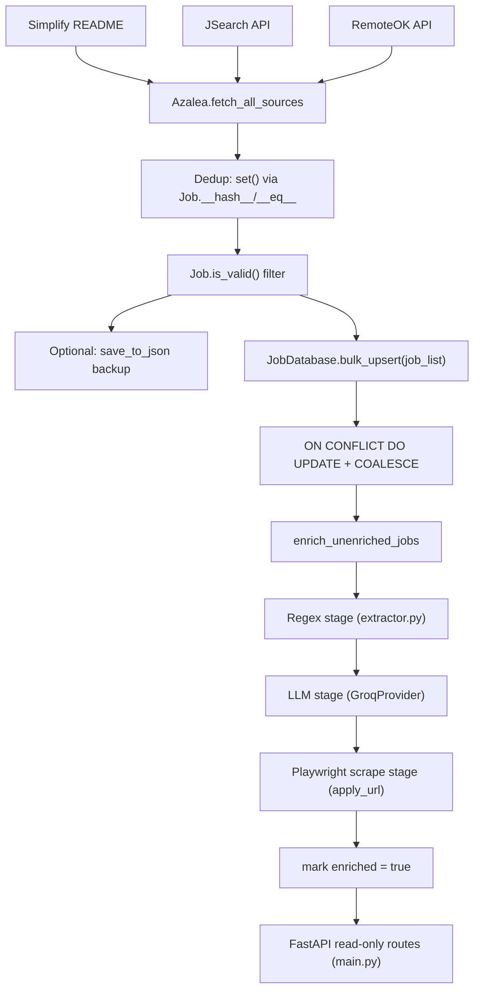

# Architecture

## End-to-end flow

## Orchestrator: `Service/azalea.py`

`Azalea` is the controller. `_init_helpers()` builds a `helpers` dict keyed by `JobSource` enum — Simplify is always on, JSearch/RemoteOK only if their config/key is present. `run()`:

1. `fetch_all_sources()` — concurrently pulls from every configured source, tags per-source counts on `self.stats` (`JobStats`)
2. Dedup via Python `set()` — relies on `Job.__hash__`/`__eq__` keyed on `(title, company, location, apply_url)` — then filters through `Job.is_valid()`
3. Optional JSON backup to `resources/scraped_jobs.json` (debugging/replay)
4. `bulk_upsert` into `job_list` with `ON CONFLICT (title, company, apply_url) DO UPDATE` — see [[Database-Layer]] for the COALESCE trick
5. Enrichment is currently commented out of the normal `run()` path and instead triggered separately by `Tasks/enrich.py` / the GitHub Actions `enrich` job — keeps scrape and enrich as independently schedulable/retriable steps

There's also a `test=True` mode that skips fetch/dedup entirely and replays from the local JSON backup — useful for iterating on enrichment logic without re-hitting the scrape sources.

## Why enrichment is decoupled from scraping

Scraping runs 5x/day (cron in `scarpe.yaml`); enrichment only runs on the `0 5 * * *` slot (or manual dispatch). This keeps Groq API usage bounded and means a scrape failure doesn't block enrichment of already-inserted rows, and vice versa.

See [[Enrichment-Pipeline]] for the 3-stage fill logic and [[Deployment-CI-CD]] for the actual schedule/workflow wiring.
