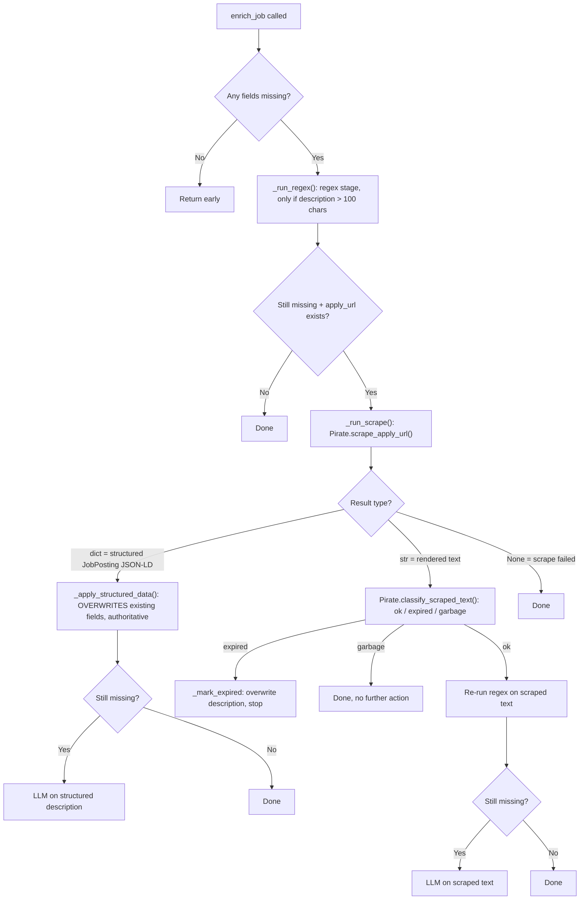

# Enrichment Pipeline

Four files now: `Service/Scrapper.py` (`Pirate`), `Refine/extractor.py` (`JobEnricher`, `RegexConstants`), `Refine/llm.py` (`LLMProvider`, `OllamaProvider`, `LLMParseError`), `Utils/sanitate.py` (`JobDataSanitizer`). Goal is unchanged: fill `pay_range`, `is_remote`, `role_type`, `location`, `tags`, `description` without ever overwriting a field that's already populated — except structured markup from the employer's own page, which is treated as authoritative and does overwrite.

## Provider: Ollama, not Groq

`llm.py` currently ships with **`OllamaProvider`** as the only active provider — `deepseek-r1:8b`, run fully locally via `pip install ollama` + `ollama pull deepseek-r1:8b`. The old `GroqProvider` class is still in the file but fully commented out ("Trying to fully rely on Ollama for now, since Groq is a paid service and Ollama is free and local"). If you ever need to swap back or add a new provider, subclass `LLMProvider` and implement `complete(prompt) -> str`.

## Entry point: `refine.py` → `enrich_unenriched_jobs()`

Called from `Tasks/enrich.py` (or manually). Per batch:

1. `db.select("job_list", filters={"enriched": False}, limit=batch_size)` — oldest unenriched rows first
2. Fast-path skip if nothing in `ENRICH_FIELDS` is actually missing
3. `_row_to_job(row)` reconstructs a `Job` from the DB row
4. A **fresh `JobEnricher` instance is created per job** and its `.enrich_job(job)` method is called — this matters because `JobEnricher.__init__` builds a `self.meta` dict that isn't reset between calls, so reusing one instance across a batch would silently accumulate `fields_filled`/`stages_run` from every prior job into each result
5. Persist via `db.upsert(...)` with `enriched=True`
6. `llm_delay` (default 0.5s) sleep between rows

New failure handling: if the LLM call raises `LLMParseError` (output unparseable even after repair), the row's `enrich_attempts` counter increments. Once it hits `MAX_ENRICH_ATTEMPTS` (3), the job is marked `enriched=True` anyway so it stops being retried forever. Any other exception (network, DB) is treated as transient — the row is left `enriched=False` and picked up again next run.

> ⚠️ **Bug found and fixed (see repo history):** `refine.py` was importing a top-level `enrich_job` function from `extractor.py` that no longer exists after the `JobEnricher` refactor — this broke `enrich_unenriched_jobs()` entirely (`ImportError` at module load). Fixed by importing `JobEnricher` and instantiating it per-job instead.

## `JobEnricher.enrich_job()` — the pipeline stages

### Stage 1 — Regex (`RegexConstants`, in `extractor.py`)

Same fields as before (pay, remote, role type, experience years) but the pay regex is meaningfully hardened:

- **Anchor-keyword logic**: a bare number range with no currency symbol, no `k` suffix, and no captured time unit (e.g. "10-15") needs a nearby pay-related keyword (`salary`, `compensation`, `per hour`, etc.) within 25 chars to be trusted — otherwise it's rejected. This exists specifically to stop "10-15 years experience" from being misread as a salary range.
- **Veto keywords**: even *with* a nearby pay keyword, terms like `years`, `employees`, `reports`, `reviews` right next to the number veto the match.
- **k-suffix propagation**: `"90-110k"` only has the `k` on the second number in the raw regex match — it's now propagated to the first number too, so `90` doesn't get read as `$90` instead of `$90,000`.

### Stage 2 — Scrape (`Pirate.scrape_apply_url`, in `Service/Scrapper.py`)

This absorbed what used to be inline in `extractor.py`, plus new capability:

- **Structured data first**: before falling back to rendered-text scraping, it looks for a schema.org `JobPosting` JSON-LD `<script>` block in the page — most ATS platforms (Workday, Greenhouse, Lever) embed this for Google for Jobs indexing. If found, it's parsed into `{description, location, is_remote, pay_range, job_expired}` and returned as a **dict** rather than a string — callers know to treat this as ground truth and overwrite, not merge.
- **Expired-redirect detection**: `_SITE_EXPIRED_URL_PATTERNS` matches known dead-link redirect patterns per domain (LinkedIn's `trk=expired_jd_redirect`, Workday's `/error`/`/notfound`/`sessionTimedOut`) and bails out early with `None` rather than scraping a dead page.
- **Workday-specific wait**: if the URL is `myworkdayjobs.com`, it waits for the `[data-automation-id="jobPostingDescription"]` selector before reading content, since Workday renders the description asynchronously.
- **Multi-frame text extraction**: checks `page.frames` and keeps whichever frame has the longest extracted text — some ATS platforms render the actual posting inside an iframe.
- **Cookie-banner stripping**: removes elements matching cookie/consent id/class patterns before extracting text, and a regex (`_COOKIE_NOTICE_RE`) strips leftover cookie-notice boilerplate from the extracted text.
- **`classify_scraped_text()`**: after getting rendered text (not structured data), classifies it as `"expired"` (matches known expired-listing phrases), `"garbage"` (login walls, Cloudflare challenge pages, 403/404 text, or just too short — under 300 chars), or `"ok"`.

### Stage 3 — LLM (`OllamaProvider.extract`, via `LLMProvider.extract`)

- Prompt (`Utils/constants.py::LLMConstants._LLM_PROMPT`) now asks for a richer `tags` structure — `requirements`, `preferred`, `skills`, `technologies`, `certifications` as separate lists, not just a flat skill/experience dict — plus a `job_expired` boolean the model can set if the scraped text itself signals a dead posting.
- **JSON repair pipeline** (`_try_repair_json` in `llm.py`): if the raw response doesn't parse as JSON, it tries (in order) the optional `json_repair` library, smart-quote normalization, trailing-comma stripping, single-quote-to-double-quote conversion (only if there are no legitimate double quotes already), and finally a regex pull of the first `{...}` block. If none of that works, raises `LLMParseError` rather than silently returning `{}` like the old Groq-only version did — this is what feeds the `enrich_attempts` retry-cap logic in `refine.py`.
- **`JobDataSanitizer.sanitize()`** (`Utils/sanitate.py`) runs on every successfully parsed response before it touches the `Job`/DB: clamps `pay_range` to numeric-or-None and swaps min/max if reversed, coerces `role_type` to a canonical enum value (falling back to keyword matching, then `"other"`), coerces `is_remote` to strict `True`/`False`/`None` from whatever string variant the model returned, forces `job_expired` to a strict bool, flattens/cleans `tags` to `dict[str, str]` capped at `_MAX_TAGS` entries, and truncates free-text fields to their configured length limits.

## Key invariant, unchanged

`_apply_to_job()` still only ever writes a field if `Config.is_missing(current_value)` — this is what makes repeated enrichment passes safe. The one deliberate exception is `_apply_structured_data()`, used only for schema.org JobPosting data, which **does overwrite** on the reasoning that vendor-supplied structured markup is more trustworthy than whatever value came from the original scrape source.
