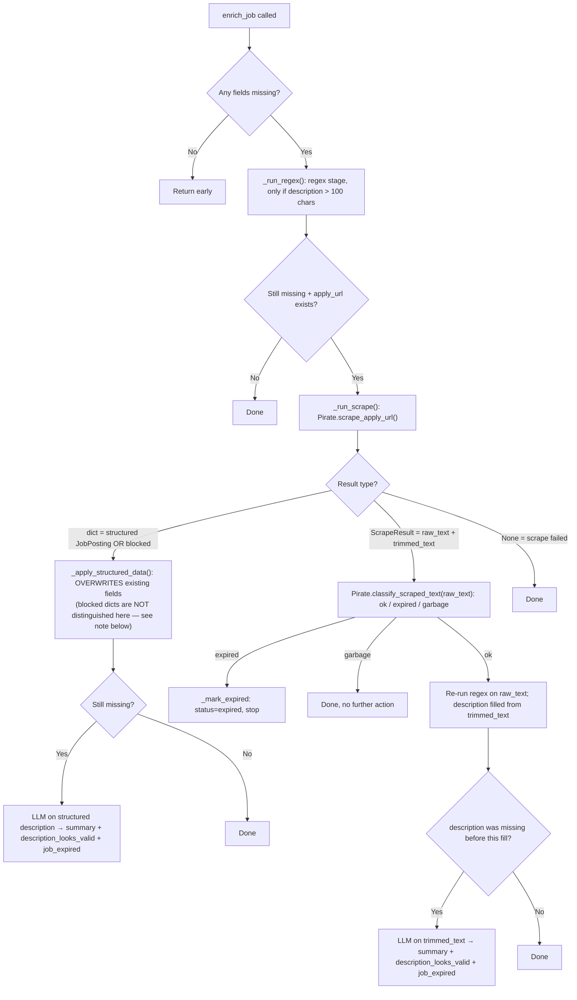

# Enrichment Pipeline

Four files: `Service/Scrapper.py` (`Pirate`), `Refine/extractor.py` (`JobEnricher`, `RegexConstants`), `Refine/llm.py` (`LLMProvider`, `OllamaProvider`, `LLMParseError`), `Utils/sanitate.py` (`JobDataSanitizer`). Goal is unchanged: fill `pay_range`, `is_remote`, `role_type`, `location`, `tags`, `description` (and now `summary`) without ever overwriting a field that's already populated — except structured markup from the employer's own page, which is treated as authoritative and does overwrite.

## Provider: Ollama, not Groq

`llm.py` ships with **`OllamaProvider`** as the only active provider — `deepseek-r1:8b`, run fully locally via `pip install ollama` + `ollama pull deepseek-r1:8b`. The old `GroqProvider` class is still in the file but fully commented out. If you ever need to swap back or add a new provider, subclass `LLMProvider` and implement `complete(prompt) -> str`. `LLMProvider` also exposes `check_expired(text)` — a narrow, dedicated call used only by the [[Roadmap|weekly expiry checker]], never by the main enrichment path.

## Entry point: `refine.py` → `enrich_unenriched_jobs()`

Called from `Tasks/enrich.py` (or manually). Per batch:

1. `db.select("job_list", filters={"enriched": False, "status": "active"}, order_by="created_at DESC", limit=batch_size)` — newest unenriched active rows first, so the jobs most likely to still be relevant get enriched before older ones
2. Fast-path skip if nothing in `ENRICH_FIELDS` is actually missing
3. `_row_to_job(row)` reconstructs a `Job` from the DB row — now also normalizes `tags` if the DB handed it back as a raw JSON string (`"{}"`, `"null"`, etc.) instead of an already-parsed dict
4. A **fresh `JobEnricher` instance is created per job** and its `.enrich_job(job)` method is called — `JobEnricher.__init__` builds a `self.meta` dict that isn't reset between calls, so reusing one instance across a batch would silently accumulate `fields_filled`/`stages_run` from every prior job into each result
5. Persist via `db.upsert(...)` with `enriched=True`
6. `llm_delay` (default 0.5s) sleep between rows, skipped after the last row

Failure handling is unchanged: if the LLM call raises `LLMParseError` (output unparseable even after repair), the row's `enrich_attempts` counter increments. Once it hits `MAX_ENRICH_ATTEMPTS` (3), the job is marked `enriched=True` anyway so it stops being retried forever. Any other exception (network, DB) is treated as transient — the row is left `enriched=False` and picked up again next run.

**New in this pass:** the whole per-row body now runs inside a `tqdm` progress bar (with a background thread calling `pbar.refresh()` once a second so the bar keeps moving during long, silent LLM calls), and the final log line now also lists the enriched job IDs/titles for that run.

## `JobEnricher.enrich_job()` — the pipeline stages

### Stage 1 — Regex (`RegexConstants`, in `extractor.py`)

Unchanged: pay/remote/role-type/experience regex with anchor-keyword logic (a bare number range needs a nearby pay keyword within 25 chars to be trusted), veto keywords (`years`, `employees`, `reports`, `reviews` next to a number veto the match), and `k`-suffix propagation (`"90-110k"` → both numbers get the `k`).

### Stage 2 — Scrape (`Pirate.scrape_apply_url`, in `Service/Scrapper.py`)

Returns one of three shapes now, and the distinction matters more than before:

- **A `dict`** — either a schema.org `JobPosting` JSON-LD block (authoritative, `{description, location, is_remote, pay_range, job_expired}`) **or** a new `{"blocked": True, "status_code": 403|429}` shape returned when the site actively refused the request. `_run_scrape()` currently treats **any** dict the same way — it doesn't check for `blocked` before calling `_apply_structured_data()` on it. In practice a blocked dict has none of the expected keys, so it's a harmless no-op rather than a crash, but it also means a blocked scrape silently looks like "nothing to apply" instead of being logged or retried as blocked — worth fixing (contrast with `Tasks/expired.py`'s `_deep_check()`, which does check `scraped.get("blocked")` explicitly and counts it separately).
- **A `ScrapeResult` dataclass** (`raw_text`, `trimmed_text`) — replaces the old bare `str` return. `raw_text` is the full cookie-stripped page text, used for regex and `classify_scraped_text()`. `trimmed_text` is narrowed by the new `_trim_to_description()` to the window between a start marker ("responsibilities", "about the role", "about the team", "what you'll do") and an end marker ("job information", "why join us", "diversity & inclusion", "equal employment opportunity", "accommodation") — this is what fills `job.description` directly and what gets sent to the LLM, so boilerplate sections no longer dilute either.
- **`None`** — scrape failed or hit a known-expired redirect.

Other scrape-stage capabilities, unchanged: structured-data-first lookup, `_SITE_EXPIRED_URL_PATTERNS` expired-redirect detection, Workday-specific selector wait, multi-frame text extraction (longest frame wins), and a two-layer cookie-banner strip (`_strip_cookie_boilerplate` regexes plus the new `_trim_trailing_cookie_banner()` fallback, which looks for known cookie phrases in the last 600 chars and cuts everything from there onward rather than matching exact vendor wording). New: `BLOCKED_STATUS_CODES = {403, 429}` is checked immediately after both the Playwright `page.goto()` response and the `requests` fallback, before any expired-redirect or content parsing runs.

`classify_scraped_text()` itself is unchanged: `"expired"` / `"garbage"` (login walls, Cloudflare challenge pages, or under 300 chars) / `"ok"`.

### Stage 3 — LLM (`OllamaProvider.extract`, via `LLMProvider.extract`)

The output schema changed. The prompt (`Utils/constants.py::LLMConstants._LLM_PROMPT`) now asks for:

- **`summary`** (2–4 sentences, in the model's own words) instead of the old `description` field — `job.description` is now filled directly from the scraped `trimmed_text`, not generated by the LLM. The LLM's `summary` only lands on `job.summary` (a new field — see [[Database-Layer]]), and only if `job.summary` was still missing.
- **`description_looks_valid`** (bool) — true if the scraped text read as an actual job description, false if it looked like navigation, an error/login page, or garbled text. A `false` here doesn't block the description fill; it just appends a warning to `self.meta["warnings"]`.
- **`job_expired`** — now specified in the prompt to never return `null`, only `true`/`false`.
- Pay-range guidance in the prompt was rewritten with concrete before/after examples (`"$45/hr"` → `[45, null]`, explicitly **not** annualized into both slots) instead of prose rules.
- **`tags`** — unchanged shape (`requirements`, `preferred`, `skills`, `technologies`, `certifications`, `experience_years`), but the old `_MAX_TAGS = 11` cap and the per-value 100-char truncation in `JobDataSanitizer._normalise_tags()` have both been removed — tags are no longer artificially capped or truncated.

**JSON repair pipeline** (`_try_repair_json` in `llm.py`) is unchanged: optional `json_repair` library → smart-quote normalization → trailing-comma stripping → single-to-double-quote conversion → regex pull of the first `{...}` block → `LLMParseError` if nothing works.

**`JobDataSanitizer.sanitize()`** (`Utils/sanitate.py`) now runs an extra step: `_normalise_description_valid()`, which coerces `description_looks_valid` into a strict bool (defaulting to `True`/fail-open if missing or unparseable). Everything else — pay clamping, role-type coercion, `is_remote` coercion, `job_expired` bool coercion, text-field length limits (now keyed on `summary`, not `description`) — is unchanged in shape, just no longer tag-capped.

## `_apply_to_job()` — merge logic, reworked

Still only writes non-tag fields if `Config.is_missing(current_value)`. What changed:

- `job_expired` is now explicitly skipped as a pure control signal (handled by the caller via `_mark_expired`), regardless of whether the caller already popped it — so this function stays safe to call even if a future caller forgets to pop it first.
- **Tags merging is more defensive.** `job.tags` can come back from the DB as a raw JSON string instead of an already-parsed dict; `_apply_to_job` now normalizes that (`json.loads`, falling back to `{}` on a parse error) before merging, and always writes the normalized dict back onto `job.tags` even when nothing new was actually added — so the type stays consistent for the next stage.
- `Config.is_missing()` itself grew new cases: the literal strings `"{}"`, `"[]"`, `"null"`, and `"None"` now count as missing, alongside the existing `""`, `"Unknown"`, `"other"`, `"unknown"`.

`_apply_structured_data()` is unchanged in behavior: used only for schema.org JobPosting data, and **does overwrite**, on the reasoning that vendor-supplied structured markup is more trustworthy than the original scrape source.

## New, separate: `Tasks/embeddings.py` — standalone embedding + example-bank pass

Not part of `enrich_unenriched_jobs()` anymore. `run_embedding_pass(batch_size=50)`:

1. Pulls `job_list` rows where `enriched=True` and `enrich_attempts < 5`
2. For each, builds an embedding-input string from title + description + tags (`skills`/`technologies`/`requirements`), embeds it via a direct HTTP call to `http://localhost:11434/api/embeddings` (model `nomic-embed-text`), and writes the resulting `pgvector` `Vector` onto `job_list.embedding`
3. Reuses that same embedding (no re-embedding) to evaluate promotion into `enrichment_examples` via `maybe_promote_to_example_bank()` — skipped if `enrich_attempts > 1`, if the job fails `passes_sanity_checks()` (valid `role_type`, sane `pay_range`, real `location`, `description` ≥ 50 chars), or if it's cosine-similarity ≥ 0.95 to an existing example
4. Posts a Discord summary via `notify_discord(..., file_path="embedded_jobs.txt")` on completion

This is not yet wired into any GitHub Actions workflow — see [[Deployment-CI-CD]] and [[Roadmap]]. It must currently be run manually.