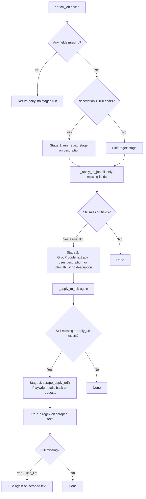

# Enrichment Pipeline

Three files: `Refine/extractor.py`, `Refine/llm.py`, `Refine/refine.py`. Goal: fill in `pay_range`, `is_remote`, `role_type`, `location`, `tags`, `description` on a `Job` without ever overwriting a field that's already populated.

## Entry point: `refine.py` → `enrich_unenriched_jobs()`

Called from `Tasks/enrich.py` (or manually). Flow per batch:

1. `db.select("job_list", filters={"enriched": False}, limit=batch_size)` — pulls oldest unenriched rows first
2. `_needs_enrichment(row)` fast-path — if none of `ENRICH_FIELDS = (description, is_remote, role_type, pay_range, tags)` are missing, mark enriched and skip straight through (no LLM call wasted)
3. `_row_to_job(row)` reconstructs a `Job` dataclass from the raw DB row
4. `enrich_job(job, provider, use_llm)` (from `extractor.py`) does the actual field-filling — see below
5. Persist via `db.upsert(... payload with enriched=True ...)`
6. `llm_delay` (default 0.5s) sleep between rows to respect Groq free-tier rate limits

Stats returned: `{attempted, enriched, skipped, errors}`.

## `enrich_job()` — the 3-stage fill in `extractor.py`



Key invariant, enforced in `_apply_to_job()`: a field is only ever written if `Config.is_missing(current_value)` is true. Tags are merge-only (`{**new, **existing}` — existing keys win). This is what makes the pipeline safe to re-run on a job repeatedly without clobbering good data with a worse guess.

### Stage 1 — Regex (`run_regex_stage`)

Cheap, no API cost, runs first when there's a real description (>100 chars after HTML stripping):

- `_regex_pay` — matches currency symbols + ranges (`$80k - $100k`, `€50,000/year`, etc.), rejects anything under 10 (filters out noise like "3 years")
- `_regex_remote` — looks for remote/WFH vs onsite/hybrid keywords
- `_regex_role_type` — full-time/part-time/contract/internship/freelance, normalized via `_ROLE_NORM`
- `_regex_experience` — years-of-experience patterns, stored as a `tags["experience_years"]` string like `"3-5"` or `"5+"`

### Stage 2 — LLM (`GroqProvider`, in `llm.py`)

- Model: `llama-3.3-70b-versatile`, `temperature=0`, forced `response_format: json_object`
- Prompt (`_LLM_PROMPT`) explicitly passes in "already known" fields so Groq doesn't re-guess what's already filled, and asks for strict schema output
- Runs even without a description — falls back to just `title + location + apply_url` as context, which lets Groq at least infer `role_type`/`is_remote` and write a short generated `description`
- `_normalise_pay()` forces `pay_range` into `[min, max]` (or `[min, None]`) shape regardless of what the model returns
- On any parse/API failure, `extract()` catches and returns `{}` (never raises into the caller)

### Stage 3 — Scrape fallback (`scrape_apply_url`)

Only runs if fields are still missing *and* the job has an `apply_url`. Playwright-first (handles Workday/Greenhouse/Taleo JS rendering), strips nav/footer/header/script/style, truncates to 10k chars. Falls back to a plain `requests` + BeautifulSoup pull if Playwright isn't installed or fails. After scraping, regex re-runs on the fresh text, then LLM again if still needed.

## LLM provider abstraction

`LLMProvider` is an ABC — subclasses just implement `complete(prompt) -> str`; the shared `extract()` method handles prompt building, JSON parsing (stripping ```` ```json ```` fences), and normalization. Currently only `GroqProvider` is implemented; there's a commented-out `Phi3Provider` stub for a local Hugging Face model if Groq ever needs a fully-offline fallback.
