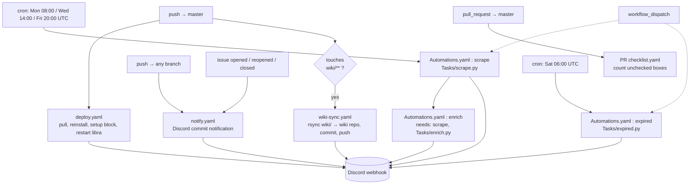

# Workflows

Every GitHub Actions workflow in `.github/workflows/`, what triggers it, and
what it actually does. All the deploy/automation workflows SSH into the
production droplet (see [[Deployment-CI-CD]] for the box layout, the venv, the
systemd unit, and the deploy script's setup block). This page is the catalog;
[[Deployment-CI-CD]] is the environment.

There are **five** workflow files:

| File | Name | Trigger | Purpose |
|---|---|---|---|
| `deploy.yaml` | Libra Deploy CI/CD | push to `master` | Pull code + reassert environment + restart the API service |
| `Automations.yaml` | Automation | cron (3×/week + weekly) + manual | Scrape → enrich, and a separate weekly expiry sweep |
| `wiki-sync.yaml` | Sync Wiki | push to `master` touching `wiki/**` + manual | Mirror `wiki/` into the GitHub Wiki repo |
| `notify.yaml` | Issues Notification CI/CD | push to **any** branch + issue open/reopen/close | Discord activity notifications |
| `PR checklist.yaml` | PR Checklist | pull request to `master` | Fail the PR until every checklist box is ticked |



---

## `deploy.yaml` — API deploy

**Trigger:** `push` to `master` (any commit).

One `deploy` job. Checks out the repo (for nothing but the action context — the
real work happens over SSH) and runs a single `appleboy/ssh-action` step against
the droplet **as root**:

```bash
cd /var/www/libra/
source libra/bin/activate
git fetch origin
git reset --hard origin/master          # code always matches master exactly
pip install -r requirements.txt --upgrade-strategy only-if-needed

# ── self-sufficient setup block (merged in from installer.ps1) ──
pip install --upgrade gunicorn uvicorn asyncpg pgvector ollama
playwright install
playwright install-deps
command -v ollama >/dev/null 2>&1 || curl -fsSL https://ollama.com/install.sh | sh
ollama list | grep -q "qwen2.5:3b-instruct" || ollama pull qwen2.5:3b-instruct
ollama list | grep -q "nomic-embed-text"   || ollama pull nomic-embed-text

sudo systemctl restart libra
```

Notes:

- **Every deploy is self-sufficient.** The setup block re-asserts the full
  runtime — the manual-install packages that `requirements.txt` may not pin,
  Playwright browsers + system deps, the Ollama binary, and both models
  (`qwen2.5:3b-instruct` for enrichment/expiry, `nomic-embed-text` for
  embeddings). This replaces the old flow of running `installer.ps1` (or an
  equivalent shell script) separately after a deploy. `installer.ps1` is now
  only for **local dev machine** setup.
- **Ordering is deliberate.** `set -euo pipefail` is active, and the `ollama
  pull` lines run **before** `systemctl restart libra` — so a failed model pull
  aborts the deploy while the old service is still up, rather than restarting
  into a service that can't reach its model.
- The `pip install` / `ollama pull` steps are all idempotent — a no-op on a
  box that's already current.
- **Discord notification on both success and failure** (webhook + user mention).

---

## `Automations.yaml` — scrape, enrich, expiry

**Triggers:** `schedule` (four crons, below) + `workflow_dispatch`.

```
cron: '0 8 * * 1'    # Mon 08:00 UTC (~03:00 ET)  → scrape + enrich
cron: '0 14 * * 3'   # Wed 14:00 UTC (~09:00 ET)  → scrape + enrich
cron: '0 20 * * 5'   # Fri 20:00 UTC (~15:00 ET)  → scrape + enrich
cron: '0 6 * * 6'    # Sat 06:00 UTC (~01:00 ET)  → weekly expiry checker
```

GitHub cron is always UTC and can be delayed by a few minutes (or more, under
load) — nothing here depends on exact timing.

### Why this schedule

- **Scrape runs 3×/week, not daily.** Job boards (Simplify / Speedy READMEs,
  JSearch) don't refresh meaningfully more often than every 2–3 days, so the
  goal is even weekly coverage, not frequency. Mon / Wed / Fri gives no
  back-to-back days and gaps of roughly **54h / 54h / 60h** (the long gap spans
  the weekend). The hour is staggered across the day (08:00 / 14:00 / 20:00
  UTC) so postings created at different times of day all get picked up rather
  than always sampling the same window.
- **Expiry runs weekly, on Saturday** — the one day with no scrape — so the 4 GB
  droplet isn't running the Playwright scraper and the Ollama enricher for two
  heavy jobs at once. 06:00 UTC / ~01:00 ET is a low-traffic slot. This matches
  the "Weekly expiry checker" intent in `Tasks/expired.py`'s docstring.

### Jobs

| Job | `needs` | Runs when | Script | Log | Discord |
|---|---|---|---|---|---|
| `scrape` | — | its 3 crons **or** manual dispatch | `Tasks/scrape.py` | `logs/scrape.log` | on failure |
| `enrich` | `scrape` | **every time `scrape` runs** | `Tasks/enrich.py` | `logs/enrich.log` | on failure |
| `expired` | — | Sat cron **or** manual dispatch | `Tasks/expired.py` | `logs/expired.log` | on **success and failure**, with the log file attached |

- **`scrape`** has an explicit `if` limiting it to its own three cron strings
  (plus `workflow_dispatch`). Without it, `scrape` would also fire on the Sat
  expiry cron, because it has no `needs`. Each job SSHes in, `git reset --hard
  origin/master`, `pip install -r requirements.txt`, then runs its task with
  `PYTHONPATH=/var/www/libra`.
- **`enrich`** has **no schedule filter** — it runs on every `scrape` run.
  `needs: scrape` gates it: if `scrape` is skipped (e.g. the Sat cron) or fails,
  `enrich` is skipped too. This is the intended once-per-scrape coupling; the
  old `if: github.event.schedule == '0 5 * * *'` hack (run enrich on 1 of 5
  daily scrapes) is gone now that scrape itself only fires 3×/week.
- **`expired`** runs `git reset --hard` first (like `scrape`), then
  `Tasks/expired.py` with `set -uo pipefail` (**no `-e`** — a failing Python run
  must still reach the notify step). It always posts to Discord and attaches
  `logs/expired.log` to the message.

### Not scheduled here

`Tasks/embeddings.py` (the standalone embedding / RAG example-bank pass) has
**no job in this workflow**. It still has to be run manually on the droplet
until a job is added — see [[Roadmap]] and [[Enrichment-Pipeline]].

### Local testing

`Tasks/scrape.py`, `Tasks/enrich.py`, and `Tasks/expired.py` are all still
runnable directly:

```bash
PYTHONPATH=. python3 Tasks/scrape.py
```

Nothing CI-only is imported by them — the workflow only wraps the same
entrypoints in SSH + logging + Discord.

---

## `wiki-sync.yaml` — mirror the wiki

**Triggers:** `push` to `master` that touches `wiki/**` + `workflow_dispatch`.

Checks out this repo and the separate `${repo}.wiki` repo (auth via the
`WIKI_DEPLOY_TOKEN` secret), then:

```bash
rsync -av --delete --exclude='.git' main/wiki/ wiki/
# commit + push only if git diff --cached is non-empty
```

So the pages under `wiki/` in this repo are the source of truth; the GitHub Wiki
is a generated mirror. If you're reading this **on** the GitHub Wiki, this
workflow is what put it there — edit `wiki/Workflows.md` in the main repo, not
the wiki page.

Discord notification has three branches: failure, success-with-changes, and
success-but-nothing-to-sync.

---

## `notify.yaml` — repo activity → Discord

**Triggers:** `push` to **any** branch, and `issues` (`opened`, `reopened`,
`closed`).

One `notify` job, no build steps — just `curl` calls to the Discord webhook
using a role mention (`DISCORD_ROLE_ID`):

- **push** → posts commit info (repo, branch, SHA, message, author). The step
  guards are `if: success() && github.event_name == 'push'` /
  `if: failure() && ...`; since the job does no actual work, the success branch
  effectively fires on **every push to every branch**. The message text says
  "Deploy Successful" but nothing here deploys or tests — treat it as a
  "commit landed" ping, not a deploy status. (The real deploy status comes from
  `deploy.yaml`, master only.)
- **issue opened** → posts title, opener, link.
- **issue closed** → posts a "closed" variant (the `opened`/`reopened` handler
  also fires for those actions).

This is the workflow responsible for the Discord noise on feature branches.

---

## `PR checklist.yaml` — checklist gate

**Trigger:** `pull_request` (`opened`, `edited`, `synchronize`, `reopened`)
targeting `master`. `concurrency` is keyed per PR number with
`cancel-in-progress: true`, so rapid edits don't stack runs.

One `actions/github-script` step: it reads the PR body, counts `- [ ]`
(unchecked) vs `- [x]` (checked), and `core.setFailed(...)` if **any** box is
unchecked. If an item genuinely doesn't apply, the convention is to check it
anyway and explain in a PR comment. The checklist content itself lives in
`.github/PULL_REQUEST_TEMPLATE.md`.

Purely a merge gate — no SSH, no deploy, no Discord.

---

## Secrets

| Secret | Used by |
|---|---|
| `SSH_HOST`, `SSH_USER`, `SSH_PRIVATE_KEY` | `deploy.yaml`, `Automations.yaml` |
| `DISCORD_WEBHOOK` | all four notifying workflows |
| `DISCORD_ROLE_ID` | `notify.yaml` (role mention) |
| `WIKI_DEPLOY_TOKEN` | `wiki-sync.yaml` (push access to the wiki repo) |

`GITHUB_TOKEN` (automatic) is what `PR checklist.yaml`'s `github-script` step
uses — no secret to configure.
